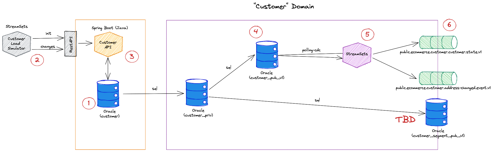

# Customer Subdomain - Customer Data Product

## Data Product Canvas

For the Customer Data Product the following canvas has been defined


## Exposed Ports
 
 * Kafka 
   * `public.ecommerce.customer.customer.state.v1` - a log compacted topic (keyed by `customerId`
   * `public.ecommerce.customer.address-changed.event.v1` - an event topic with each change of an address for a data retention of 1 week


## Implementation

The following diagram shows the internal working of the Customer Domain with the Customer Data Product:




## (1) Initialize static data

The following StreamSets Pipelines are handling the initialization of some static data at simulation time zero.

 * **customer_init** - Initializes the static datasets

The data for the init has to be provided in `data-transfer/data-mesh-poc/simulator/customer/init`

## (2) Simulator

The following StreamSets Pipelines are simulating the data

 * **customer_simulate-person-and-address** - simulate Person and Address inserts and updates

The data for the simulator has to be provided in `data-transfer/data-mesh-poc/simulator/customer`.

`person_obj_events.csv`

```bash
descriminator,delay_from_start_ms,person
Person,191,'{"businessEntityId":2970,"personType":"IN","nameStyle":false,"firstName":"Katherine","middleName":"E","lastName":"Patterson","emailPromotion":0,"addresses":[{"id":11992,"addressTypeId":2,"addressLine1":"7306 Pastime Drive","city":"Long Beach","stateProvinceId":9,"postalCode":"90802"}],"emailAddresses":[{"id":2165,"emailAddress":"katherine36@adventure-works.com"}],"phones":[{"phoneNumber":"670-555-0187","phoneNumberTypeId":2}]}'
Person,381,'{"businessEntityId":4068,"personType":"IN","nameStyle":false,"firstName":"Cedric","middleName":"J","lastName":"Chande","emailPromotion":2,"addresses":[{"id":13102,"addressTypeId":2,"addressLine1":"70, rue de l´Esplanade","city":"Tremblay-en-France","stateProvinceId":179,"postalCode":"93290"}],"emailAddresses":[{"id":3263,"emailAddress":"cedric33@adventure-works.com"}],"phones":[{"phoneNumber":"1 (11) 500 555-0147","phoneNumberTypeId":1}]}'
...
```

## (3) Customer Management Service

The Customer Management Service is implemented as a Microservice using Spring Boot.

### REST API

The RESTAPI is deployed on <http://dataplatform:48080>

A `POST` on `/api/customers` with a JSON document similar to the one below will add a new Person with addresses, emails and phones:

```json
{
  "businessEntityId" : 20036,
  "personType" : "IN",
  "nameStyle" : false,
  "firstName" : "Destiny",
  "lastName" : "Ward",
  "emailPromotion" : 1,
  "addresses" : [ {
    "id" : 29138,
    "addressTypeId": 1,
    "addressLine1" : "3935 Hawkins Street",
    "city" : "Langford",
    "stateProvinceId" : 7,
    "postalCode" : "V9"
  } ],
  "emailAddresses" : [ {
    "id" : 19231,
    "emailAddress" : "destiny38@adventure-works.com"
  } ],
  "phones" : [ {
    "phoneNumber" : "141-555-0193",
    "phoneNumberTypeId" : 1
  } ]
}
```

### Data Model for Customer Domain

The internal Data Model of the Customer operational system is shown in the diagram below.


It runs on Oracle in the schema `ecomm_customer`.

### Persistence

The persistence mapping of the domain object to the legacy data model is done using JDBC Template with a set of Insert statements. This is done because JPA mapping is not doable due to the mismatch between the traditional database model and the domain object model.

`PersonRepositoryImpl.java`

```java
    public void save (PersonDO customer) {
        System.out.println(customer);

        // Insert into PERSON_T
        jdbcTemplate.update("INSERT INTO person_t (business_entity_id, person_type, name_style, first_name, middle_name, last_name, email_promotion, created_date, modified_date) " +
                                "VALUES (?, ?, ?, ?, ?, ?, ?, current_timestamp, current_timestamp)"
                        , customer.getBusinessEntityId(), customer.getPersonType(), customer.getNameStyle(), customer.getFirstName(), customer.getMiddleName(), customer.getLastName(), customer.getEmailPromotion()
                    );
        for (AddressDO address : customer.getAddresses()) {
            // Insert into ADDRESS_T
            jdbcTemplate.update("INSERT INTO address_t (address_id, address_line_1, address_line_2, city, state_province_id, postal_code, created_date, modified_date) " +
                                "VALUES (?, ?, ?, ?, ?, ?, current_timestamp, current_timestamp)"
                    , address.getAddressId(), address.getAddressLine1(), address.getAddressLine2(), address.getCity(), address.getStateProvinceId(), address.getPostalcode()
                    );

            // Insert into PERSON_ADDRESS_T
            jdbcTemplate.update("INSERT INTO person_address_t (business_entity_id, address_id, address_type_id, created_date, modified_date) " +
                            "VALUES (?, ?, ?, current_timestamp, current_timestamp)"
                    , customer.getBusinessEntityId(), address.getAddressId(), address.getAddressTypeId()
            );
        }

        for (PhoneDO phone : customer.getPhones()) {
            // Insert into PERSON_PHONE_T
            jdbcTemplate.update("INSERT INTO person_phone_t (business_entity_id, phone_number, phone_number_type_id, created_date, modified_date) " +
                            "VALUES (?, ?, ?, current_timestamp, current_timestamp)"
                    , customer.getBusinessEntityId(), phone.getPhoneNumber(), phone.getPhoneNumberTypeId()
            );
        }

        for (EmailAddressDO emailAddress : customer.getEmailAddresses()) {
            // Insert into EMAIL_ADDRESS_T
            jdbcTemplate.update("INSERT INTO email_address_t (business_entity_id, email_address_id, email_address, created_date, modified_date) " +
                            "VALUES (?, ?, ?, current_timestamp, current_timestamp)"
                    , customer.getBusinessEntityId(), emailAddress.getId(), emailAddress.getEmailAddress()
            );
        }
```

## (4) Exposing the Customer Data Product using Oracle Json Views

### Private View Layer

A View layer for each table to be exposed in the data product is held in the Oracle schema `ecomm_customer_priv`. This is so that we have an indirection where we can fix potential compatiblity issues in the future between the product exposed over the JSON View and the underlying data model in `ecomm_customer`. 

```sql
CREATE OR REPLACE VIEW person_v
AS
SELECT *
FROM ecomm_customer.person_t;

...
```

### Data Product View

The JSON views are held in the Oracle schema `ecom_customer_pub_v1` and as the name reflects are currently deployed in version 1. This view acts as part of the contract and it should be held stable.

```sql
CREATE OR REPLACE 
VIEW "ECOMM_CUSTOMER_PUB_V1"."CUSTOMER_STATE_V" ("identity", "customer", "last_change", "last_change_ms") 
AS 
SELECT  JSON_OBJECT ('eventId' value sys_guid(), 'idempotenceId' value sys_guid(), 'created' value ROUND((cast(sys_extract_utc(per.created_date) as date) - TO_DATE('1970-01-01 00:00:00','YYYY-MM-DD HH24:MI:SS')) * 86400 * 1000)) as "identity"
	, JSON_OBJECT ('id' VALUE per.business_entity_id
                            , 'personType' VALUE per.person_type
                            , 'nameStyle' VALUE per.name_style
                            , 'firstName' VALUE per.first_name
                            , 'middleName' VALUE per.middle_name
                            , 'lastName' VALUE per.last_name
                            , 'emailPromotion' VALUE per.email_promotion
                            , 'addresses' VALUE (
                                        SELECT
                                            JSON_ARRAYAGG(
                                                JSON_OBJECT('addressTypeId' VALUE peradr.address_type_id
                                                ,   'id' VALUE adr.address_id
                                                ,   'addressLine1' VALUE adr.address_line_1
                                                ,   'addressLine2' VALUE adr.address_line_2
                                                ,   'city' VALUE adr.city
                                                ,   'stateProvinceId' VALUE adr.state_province_id
                                                ,   'postalCode' VALUE adr.postal_code
                                                ,   'lastChangeTimestamp' VALUE adr.modified_date
                                                )
                                            )
                                        FROM ecomm_customer_priv.person_address_v peradr
                                        LEFT JOIN ecomm_customer_priv.address_v   adr
                                            ON ( peradr.address_id = adr.address_id )
                                        WHERE per.business_entity_id = peradr.business_entity_id
                                    )
                            , 'phones' VALUE (
                                        SELECT
                                            JSON_ARRAYAGG(
                                                JSON_OBJECT('phoneNumber' VALUE perp.phone_number
                                                ,   'phoneNumberTypeId' VALUE perp.phone_number_type_id
                                                ,   'phoneNumberType' VALUE phot.name
                                                )
                                            )
                                        FROM ecomm_customer_priv.person_phone_v perp
                                        LEFT JOIN ecomm_customer_priv.phone_number_type_v phot
                                    		ON (perp.phone_number_type_id = phot.phone_number_type_id)
                                        WHERE per.business_entity_id = perp.business_entity_id
                                    )
                            , 'emailAddresses' VALUE (
                                        SELECT
                                            JSON_ARRAYAGG(
                                                JSON_OBJECT('id' VALUE ema.email_address_id
                                                ,   'emailAddress' VALUE ema.email_address
                                                )
                                            )
                                        FROM ecomm_customer_priv.email_address_v ema
                                        WHERE per.business_entity_id = ema.business_entity_id
                                    )
                    ) AS "customer"
                    , modified_date  AS "last_change"
                    , ROUND((cast(sys_extract_utc(per.modified_date) as date) - TO_DATE('1970-01-01 00:00:00','YYYY-MM-DD HH24:MI:SS')) * 86400 * 1000) AS "last_change_ms"
FROM ecomm_customer_priv.person_v per;
```

## (5) StreamSets Pipeline

A StreamSets Pipeline is implementing a query-based CDC, by periodically querying the JSON view for new data. 

There is one such pipeline for each JSON View.

 * **customer_customerstate-to-kafka**: reads from `ecomm_customer_pub_v1.CUSTOMER_STATE_V` and publishes the data to the Kafka topic `public.ecommerce.customer.customer.state.v1`
 * **customer_customeraddresschanged-to-kafka**: reads from `ecomm_customer_pub_v1.CUSTOMER_ADDRESSCHANGED_V` and publishes the data to the Kafka topic `public.ecommerce.customer.address-changed.event.v1`

The diagram below shows the implementation of `customer_customerstate-to-kafka`.


## (6) Kafka Topics

The following topics are part of the public API

 * `public.ecommerce.customer.customer.state.v1` - a log compacted topic (keyed by `customerId`
 * `public.ecommerce.customer.address-changed.event.v1` - an event topic with each change of an address for a data retention of 1 week.


