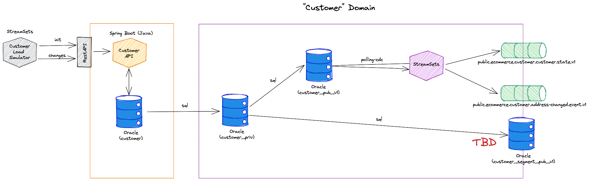
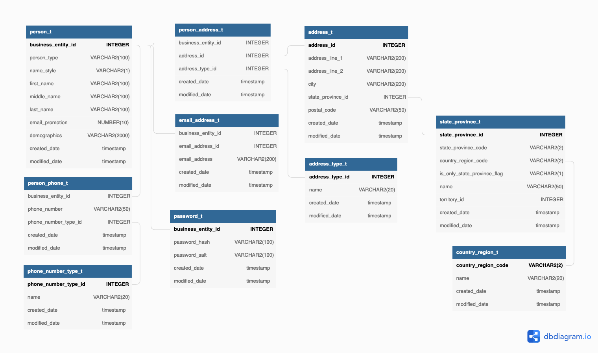

# Customer Subdomain - Customer Data Product

## Data Product Canvas

For the Customer Data Product the following canvas has been defined


## Implementation

The following diagram shows the internal working of the Customer Domain with the Customer Data Product:




## Initialize static data

The following StreamSets Pipelines are handling the initialization of the data

 * **customer_init** - Initializes the static datasets

The data for the init has to be provided in `data-transfer/data-mesh-poc/simulator/customer/init`

## Simulation

The following StreamSets Pipelines are simulating the data

 * **customer_simulate-person-and-address** - simulate Person and Address inserts and updates

The data for the simulator has to be provided in `data-transfer/data-mesh-poc/simulator/customer`.

`person_obj_events.csv`

```bash
descriminator,delay_from_start_ms,person
Person,191,'{"businessEntityId":2970,"personType":"IN","nameStyle":false,"firstName":"Katherine","middleName":"E","lastName":"Patterson","emailPromotion":0,"addresses":[{"id":11992,"addressTypeId":2,"addressLine1":"7306 Pastime Drive","city":"Long Beach","stateProvinceId":9,"postalCode":"90802"}],"emailAddresses":[{"id":2165,"emailAddress":"katherine36@adventure-works.com"}],"phones":[{"phoneNumber":"670-555-0187","phoneNumberTypeId":2}]}'
Person,381,'{"businessEntityId":4068,"personType":"IN","nameStyle":false,"firstName":"Cedric","middleName":"J","lastName":"Chande","emailPromotion":2,"addresses":[{"id":13102,"addressTypeId":2,"addressLine1":"70, rue de l´Esplanade","city":"Tremblay-en-France","stateProvinceId":179,"postalCode":"93290"}],"emailAddresses":[{"id":3263,"emailAddress":"cedric33@adventure-works.com"}],"phones":[{"phoneNumber":"1 (11) 500 555-0147","phoneNumberTypeId":1}]}'
...
```

## Rest API

The RESTAPI is deployed on <http://dataplatform:48080>

A `POST` on `/api/customers` with a JSON document similar to the one below will add a new Person with addresses, emails and phones:

```json
{
  "businessEntityId" : 20036,
  "personType" : "IN",
  "nameStyle" : false,
  "firstName" : "Destiny",
  "lastName" : "Ward",
  "emailPromotion" : 1,
  "addresses" : [ {
    "id" : 29138,
    "addressTypeId": 1,
    "addressLine1" : "3935 Hawkins Street",
    "city" : "Langford",
    "stateProvinceId" : 7,
    "postalCode" : "V9"
  } ],
  "emailAddresses" : [ {
    "id" : 19231,
    "emailAddress" : "destiny38@adventure-works.com"
  } ],
  "phones" : [ {
    "phoneNumber" : "141-555-0193",
    "phoneNumberTypeId" : 1
  } ]
}
```


## Data Model

The internal Data Model for the Customer operational systems

