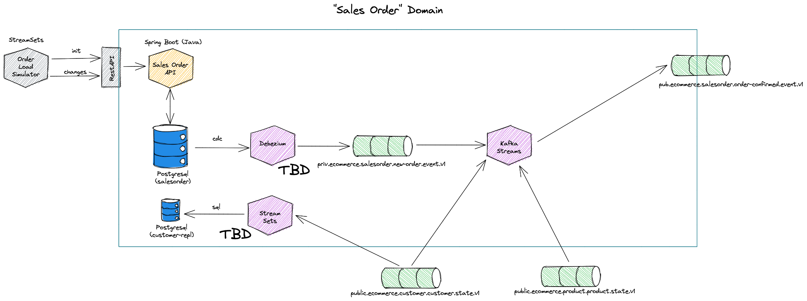
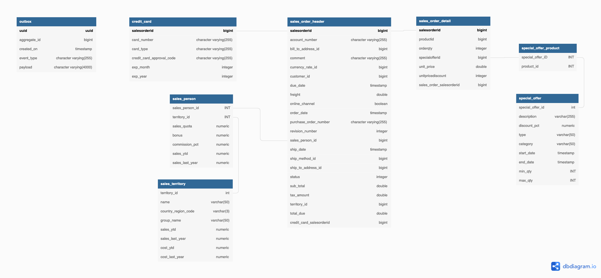

# Sales Order Subdomain - Order Processing Data Product

## Canvas


## Implementation



## Initialize static data

The following StreamSets Pipelines are handling the initialization of the data

 * **[salesorder_init](http://140.238.174.129:18630/collector/pipeline/custsimul6647b714-e368-4a50-8af4-7f2d59ebce77)** - Initializes the static datasets

The data for the init has to be provided in `data-transfer/data-mesh-poc/simulator/sales-order/init`

## Simulation

The following StreamSets Pipelines are simulating the data

 * **salesorder_simulate-order-online** - simulate new Online orders and updates

The data for the simulator has to be provided in `data-transfer/data-mesh-poc/simulator/sales-order/`.

`sales_order_obj_online_events.csv`

```bash
descriminator,delay_from_start_ms,salesOrder
SalesOrderOnline,13000,'{"id":43701,"shipMethodId":1,"revisionNumber":8,"orderDate":"2011-05-31T00:00:00.000Z","dueDate":"2011-06-12T00:00:00.000Z","shipDate":"2011-06-07T00:00:00.000Z","status":5,"onlineOrderFlag":true,"accountNumber":"10-4030-011003","customerId":11003,"territoryId":9,"billToAddressId":20425,"shipToAddressId":20425,"currencyRateId":2,"subTotal":3399.990000000000000000,"taxAmount":271.999200000000000000,"freight":84.999800000000000000,"totalDue":3756.989000000000000000,"orderDetails":[{"id":357,"quantity":1,"productId":773,"specialOfferId":1,"unitPrice":3399.990000000000000000,"unitPriceDiscount":0}],"creditCard":{"id":11150,"cardType":"ColonialVoice","cardNumber":"77775658326712","expMonth":3,"expYear":2007,"creditCardApprovalCode":"335093Vi57504"}}'
SalesOrderOnline,47000,'{"id":43699,"shipMethodId":1,"revisionNumber":8,"orderDate":"2011-05-31T00:00:00.000Z","dueDate":"2011-06-12T00:00:00.000Z","shipDate":"2011-06-07T00:00:00.000Z","status":5,"onlineOrderFlag":true,"accountNumber":"10-4030-025863","customerId":25863,"territoryId":1,"billToAddressId":19613,"shipToAddressId":19613,"subTotal":3399.990000000000000000,"taxAmount":271.999200000000000000,"freight":84.999800000000000000,"totalDue":3756.989000000000000000,"orderDetails":[{"id":355,"quantity":1,"productId":773,"specialOfferId":1,"unitPrice":3399.990000000000000000,"unitPriceDiscount":0}],"creditCard":{"id":5796,"cardType":"SuperiorCard","cardNumber":"33334270131662","expMonth":4,"expYear":2008,"creditCardApprovalCode":"333376Vi30244"}}'
SalesOrderOnline,58000,'{"id":43697,"shipMethodId":1,"revisionNumber":8,"orderDate":"2011-05-31T00:00:00.000Z","dueDate":"2011-06-12T00:00:00.000Z","shipDate":"2011-06-07T00:00:00.000Z","status":5,"onlineOrderFlag":true,"accountNumber":"10-4030-021768","customerId":21768,"territoryId":6,"billToAddressId":23148,"shipToAddressId":23148,"currencyRateId":4,"subTotal":3578.270000000000000000,"taxAmount":286.261600000000000000,"freight":89.456800000000000000,"totalDue":3953.988400000000000000,"orderDetails":[{"id":353,"quantity":1,"productId":749,"specialOfferId":1,"unitPrice":3578.270000000000000000,"unitPriceDiscount":0}],"creditCard":{"id":4319,"cardType":"SuperiorCard","cardNumber":"33331901909188","expMonth":7,"expYear":2008,"creditCardApprovalCode":"530200Vi22686"}}'
...
```

## Rest API

The RESTAPI is deployed on <http://dataplatform:48081>

A `POST` on `/api/salesOrders` with a JSON document similar to the one below will add a new Person with addresses, emails and phones:

```json
{
  "id": 43836,
  "shipMethodId": 1,
  "revisionNumber": 8,
  "orderDate": "2011-06-29T00:00:00.000Z",
  "dueDate": "2011-07-11T00:00:00.000Z",
  "shipDate": "2011-07-06T00:00:00.000Z",
  "status": 5,
  "onlineOrderFlag": true,
  "accountNumber": "10-4030-026620",
  "customerId": 26620,
  "territoryId": 6,
  "billToAddressId": 19261,
  "shipToAddressId": 19261,
  "currencyRateId": 381,
  "subTotal": 699.0982,
  "taxAmount": 55.9279,
  "freight": 17.4775,
  "totalDue": 772.5036,
  "orderDetails": [
    {
      "id": 492,
      "quantity": 1,
      "productId": 761,
      "specialOfferId": 1,
      "unitPrice": 699.0982,
      "unitPriceDiscount": 0
    }
  ],
  "creditCard": {
    "id": 6966,
    "cardType": "Distinguish",
    "cardNumber": "55556839566975",
    "expMonth": 4,
    "expYear": 2008,
    "creditCardApprovalCode": "233797Vi36226"
  }
}
```


## Data Model

The internal Data Model for the Sales Order operational systems

   