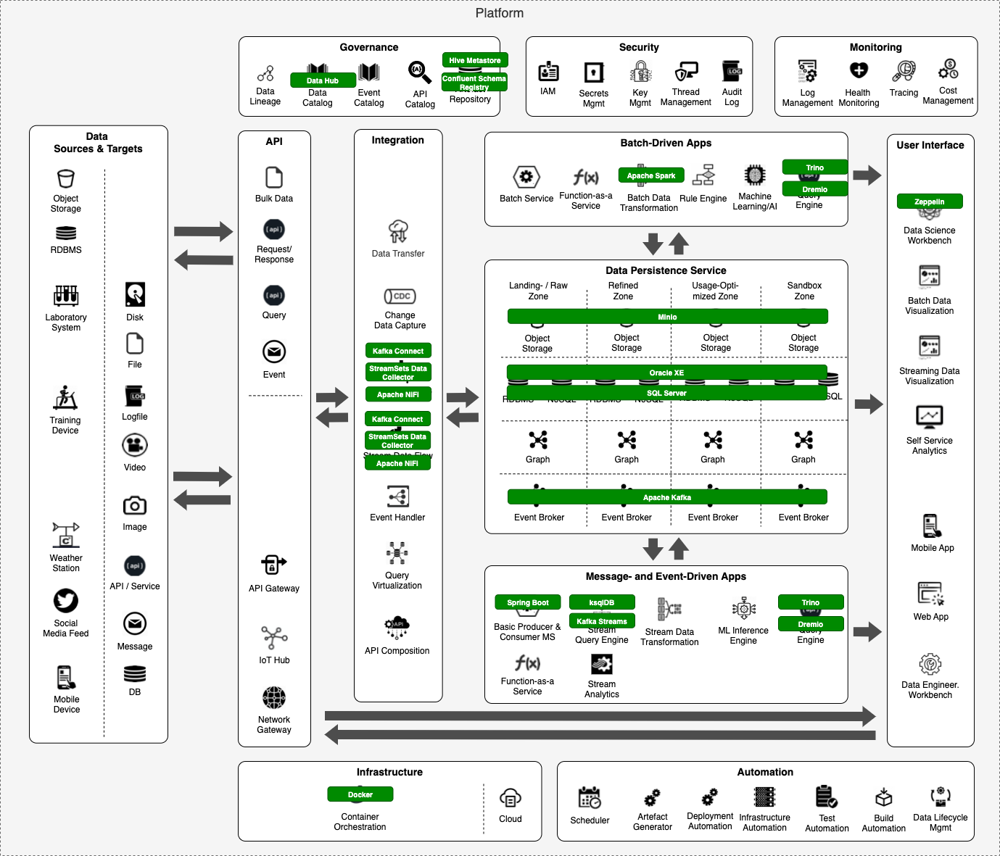

# Provided Technologies

The following diagram shows a mapping of technologies to our reference architecture. These are available as part of the data platform:

Here a list of technologies which are eligible to be used to provide a Data Product

  * **[Apache Kafka](ApacheKafka.md)** - Kafka Topic
  * **Minio & Hive Metastore** - S3 objects with metadata in Hive Metastore
  * **Delta Lake** - delta lake tables
  * **Oracle / SQL Server** - tables or views
  * **Trino / Dremio** - Distributed SQL query engine supporting different sources
  * **Rest API** - a RESTful API 
 